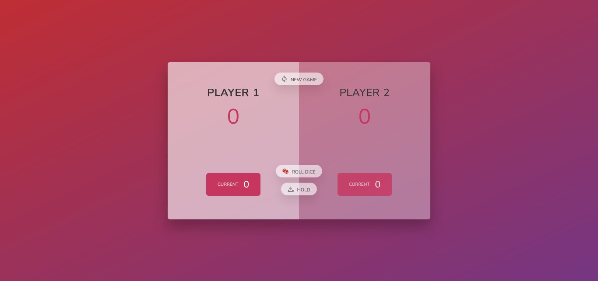

# Pig-game
My first simple game! I'm learning a lot from Jonas Schmedtmann's Javascript course and after completing some of the parts of the course I just finished making this simple Pig game. I know I didn't follow the DRY rule. I just wanted my code to work now. By the way he is a very good teacher.

- [👉Start Playing👈](https://pig-game-codepapa.netlify.app/)

## Rules of this Pig game:
- You need to roll the dice to accumulate the current scores.
- If you press the Hold button, then the current scores will be added/saved to the permanent score and the dice will be shifted to the next player.
- While you are accumulating the current scores, if your dice is "1", you will lose all the current scores that you accumulated. (Not your permanent scores)
- Whoever can make 100 permanent scores first, will win.

## Screenshot

## Flowchart

